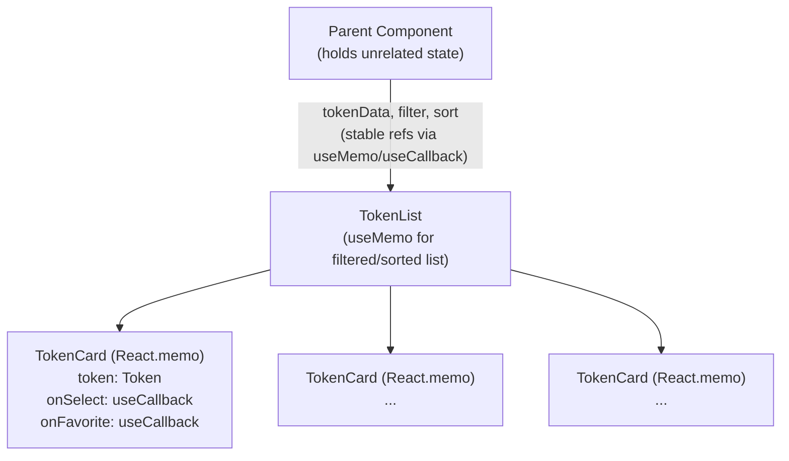

# Design Document: React Memoization Optimization

## Overview

This feature applies React memoization primitives to the Stellar-forge app's `TokenList` and `TokenCard` components to eliminate unnecessary re-renders. The three primitives used are:

- `useMemo` — caches the result of expensive filtering/sorting computations
- `useCallback` — stabilizes function references passed as props to child components
- `React.memo` — wraps `TokenCard` so it skips re-rendering when its props are shallowly equal

The goal is to make rendering work proportional to actual data changes. When unrelated state updates occur in parent components, neither `TokenList` nor `TokenCard` should re-render.

## Architecture

The optimization is purely additive — no new components, routes, or data-fetching layers are introduced. The change is confined to two component files and their immediate parent.



### Render Boundary Strategy

| Boundary | Primitive | Trigger for re-render |
|---|---|---|
| Filtered/sorted list derivation | `useMemo` | `tokenData`, `filterParam`, `sortParam` change |
| Event handler props | `useCallback` | Declared dependency values change |
| `TokenCard` component | `React.memo` | Any prop changes (shallow equality) |

## Components and Interfaces

### TokenList

Responsible for:
1. Accepting raw `tokenData`, `filterParam`, and `sortParam` as props
2. Deriving the displayed list via `useMemo`
3. Producing stable `onSelect` / `onFavorite` callbacks via `useCallback`
4. Rendering `TokenCard` for each item in the memoized list

```tsx
interface TokenListProps {
  tokenData: Token[];
  filterParam: string;
  sortParam: SortKey;
  onTokenSelect: (id: string) => void;
  onTokenFavorite: (id: string) => void;
}

function TokenList({
  tokenData,
  filterParam,
  sortParam,
  onTokenSelect,
  onTokenFavorite,
}: TokenListProps) {
  // Memoized derived list — only recomputes when inputs change
  const displayedTokens = useMemo(
    () => filterAndSort(tokenData, filterParam, sortParam),
    [tokenData, filterParam, sortParam]
  );

  // Stable callback references — only change when their deps change
  const handleSelect = useCallback(
    (id: string) => onTokenSelect(id),
    [onTokenSelect]
  );

  const handleFavorite = useCallback(
    (id: string) => onTokenFavorite(id),
    [onTokenFavorite]
  );

  return (
    <>
      {displayedTokens.map((token) => (
        <TokenCard
          key={token.id}
          token={token}
          onSelect={handleSelect}
          onFavorite={handleFavorite}
        />
      ))}
    </>
  );
}
```

### TokenCard

A pure presentational component wrapped with `React.memo`. It renders a single token's data and fires callbacks on user interaction.

```tsx
interface TokenCardProps {
  token: Token;
  onSelect: (id: string) => void;
  onFavorite: (id: string) => void;
}

const TokenCard = React.memo(function TokenCard({
  token,
  onSelect,
  onFavorite,
}: TokenCardProps) {
  return (
    <div>
      <span>{token.name}</span>
      <button onClick={() => onSelect(token.id)}>Select</button>
      <button onClick={() => onFavorite(token.id)}>Favorite</button>
    </div>
  );
});
```

`React.memo` uses shallow prop comparison by default. Because `onSelect` and `onFavorite` are stabilized with `useCallback` in the parent, reference equality holds across unrelated re-renders.

### filterAndSort (pure utility)

```tsx
function filterAndSort(
  tokens: Token[],
  filter: string,
  sort: SortKey
): Token[] {
  const filtered = tokens.filter((t) =>
    t.name.toLowerCase().includes(filter.toLowerCase())
  );
  return filtered.sort((a, b) => {
    if (sort === "name") return a.name.localeCompare(b.name);
    if (sort === "price") return b.price - a.price;
    return 0;
  });
}
```

Keeping this as a pure function outside the component body ensures `useMemo` can reference it without adding it to the dependency array.

## Data Models

### Token

```ts
interface Token {
  id: string;        // stable unique identifier
  name: string;      // display name
  symbol: string;    // ticker symbol
  price: number;     // current price in USD
  isFavorite: boolean;
}
```

### SortKey

```ts
type SortKey = "name" | "price" | "default";
```

### Memoization Dependency Map

| Hook | Location | Dependencies |
|---|---|---|
| `useMemo` (filtered list) | `TokenList` | `tokenData`, `filterParam`, `sortParam` |
| `useCallback` (handleSelect) | `TokenList` | `onTokenSelect` |
| `useCallback` (handleFavorite) | `TokenList` | `onTokenFavorite` |
| `React.memo` | `TokenCard` | all props (shallow equality) |


## Correctness Properties

*A property is a characteristic or behavior that should hold true across all valid executions of a system — essentially, a formal statement about what the system should do. Properties serve as the bridge between human-readable specifications and machine-verifiable correctness guarantees.*

### Property 1: Memoized list is stable when inputs are unchanged

*For any* token dataset, filter parameter, and sort parameter, calling `filterAndSort` with the same inputs twice should produce an equal result, and `useMemo` should return the same array reference without recomputing.

**Validates: Requirements 1.1**

---

### Property 2: Memoized list invalidates when any dependency changes

*For any* token dataset, filter parameter, or sort parameter, changing any one of them should cause `useMemo` to produce a new (different) array result that reflects the updated inputs.

**Validates: Requirements 1.2, 1.3**

---

### Property 3: Callback reference is stable across unrelated re-renders

*For any* `useCallback`-wrapped handler and any parent re-render caused by a state change that does not affect the callback's declared dependencies, the callback reference returned should be strictly equal (`===`) to the reference from the previous render.

**Validates: Requirements 2.1**

---

### Property 4: Callback reference updates when dependencies change

*For any* `useCallback`-wrapped handler, when any value in its dependency array changes, the returned reference should be a new function (not `===` to the previous render's reference).

**Validates: Requirements 2.2**

---

### Property 5: TokenCard skips render when props are unchanged

*For any* `TokenCard` instance, rendering it twice with identical props should invoke the component's render function exactly once (the second render is skipped by `React.memo`).

**Validates: Requirements 3.1**

---

### Property 6: TokenCard re-renders when any prop changes

*For any* `TokenCard` instance and any prop that changes value, the component should re-render and reflect the updated prop in its output.

**Validates: Requirements 3.2**

---

### Property 7: TokenList does not re-render on unrelated parent state changes

*For any* parent component state change that does not affect `TokenList`'s props, `TokenList`'s render function should not be invoked.

**Validates: Requirements 4.1**

---

### Property 8: TokenCard does not re-render on unrelated parent state changes

*For any* parent component state change that does not affect a `TokenCard`'s props, that `TokenCard`'s render function should not be invoked.

**Validates: Requirements 4.2**

---

### Property 9: Updated token data is reflected in TokenCard output

*For any* `Token` object and any field update applied to it, after the update propagates as a new prop to `TokenCard`, the rendered output should contain the new field value (not the stale cached value).

**Validates: Requirements 5.1**

---

### Property 10: Callbacks execute with current closure values

*For any* `useCallback`-wrapped handler whose dependencies have changed, invoking the callback after the dependency update should use the new dependency values, not the stale ones from a previous render.

**Validates: Requirements 5.2**

---

## Error Handling

### Stale Closure Prevention

The most common memoization bug is an incomplete dependency array, causing a callback or memo to capture stale values. Mitigations:

- Enable the `react-hooks/exhaustive-deps` ESLint rule — it statically enforces complete dependency arrays and will error at lint time if any referenced value is missing.
- All `useMemo` and `useCallback` calls must list every variable from the enclosing scope that is read inside the callback.

### Referential Instability of Props

If a parent passes an object or array literal directly as a prop (e.g., `<TokenList tokenData={[...]} />`), a new reference is created on every parent render, defeating `useMemo` and `React.memo`. Mitigation:

- The parent must stabilize `tokenData` with its own `useMemo` or ensure it comes from stable state (e.g., Redux selector with memoization).
- Document this constraint in the component's JSDoc.

### Over-memoization

Wrapping trivially cheap computations in `useMemo` adds overhead (dependency comparison cost) without benefit. Guideline:

- Only apply `useMemo` to computations that involve iteration over the token array (O(n) or worse).
- Do not memoize simple property accesses or string concatenations.

### React.memo with Non-Primitive Props

`React.memo` uses shallow equality. If `token` prop contains nested objects that are mutated in place rather than replaced, `React.memo` will incorrectly skip re-renders. Mitigation:

- Treat `Token` objects as immutable; always produce new object references when updating fields.

---

## Testing Strategy

### Dual Testing Approach

Both unit tests and property-based tests are required. They are complementary:

- **Unit tests** verify specific examples, integration points, and edge cases.
- **Property tests** verify universal invariants across randomly generated inputs.

### Unit Tests

Focus areas:

- `filterAndSort` with known inputs: empty array, single item, all items filtered out, sort by name, sort by price.
- `TokenCard` renders correct token fields.
- `TokenCard` fires `onSelect` / `onFavorite` with the correct `id`.
- Parent renders `TokenList` and verifies the correct number of `TokenCard` instances.

### Property-Based Tests

Use a property-based testing library appropriate for the project's language/framework (e.g., `fast-check` for TypeScript/JavaScript).

Configure each property test to run a minimum of **100 iterations**.

Each test must include a comment referencing its design property using the tag format:
`// Feature: react-memoization-optimization, Property N: <property_text>`

| Property | Test description |
|---|---|
| Property 1 | Generate random token arrays + params; assert `filterAndSort(x, f, s)` equals `filterAndSort(x, f, s)` for same inputs |
| Property 2 | Generate two different inputs (at least one dep differs); assert results are not referentially equal and reflect the new input |
| Property 3 | Render parent with arbitrary unrelated state; assert `useCallback` ref is `===` before and after unrelated state update |
| Property 4 | Render parent; change a callback dep; assert new ref is not `===` to previous |
| Property 5 | Render `TokenCard` twice with same props; assert render spy called exactly once |
| Property 6 | Render `TokenCard`; change one prop; assert render spy called a second time with updated value |
| Property 7 | Render parent + `TokenList`; trigger unrelated state change; assert `TokenList` render spy not called again |
| Property 8 | Render parent + `TokenCard`; trigger unrelated state change; assert `TokenCard` render spy not called again |
| Property 9 | Generate token; render `TokenCard`; update a field; assert output contains new value |
| Property 10 | Render with `useCallback`; change dep; invoke new callback; assert it uses updated dep value |

### Testing Library

- **Property-based**: `fast-check` (`npm install --save-dev fast-check`)
- **Component rendering**: React Testing Library (`@testing-library/react`)
- **Render spy**: `jest.fn()` wrapping the component or using `React.memo`'s second argument

### Example Property Test Skeleton

```ts
import fc from "fast-check";
import { filterAndSort } from "./utils";

// Feature: react-memoization-optimization, Property 1: Memoized list is stable when inputs are unchanged
test("filterAndSort returns equal result for same inputs", () => {
  fc.assert(
    fc.property(
      fc.array(tokenArbitrary()),
      fc.string(),
      fc.constantFrom("name", "price", "default" as SortKey),
      (tokens, filter, sort) => {
        const result1 = filterAndSort(tokens, filter, sort);
        const result2 = filterAndSort(tokens, filter, sort);
        expect(result1).toEqual(result2);
      }
    ),
    { numRuns: 100 }
  );
});
```
